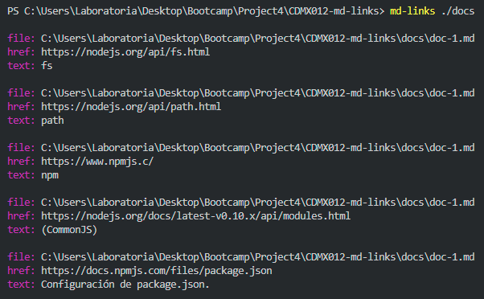
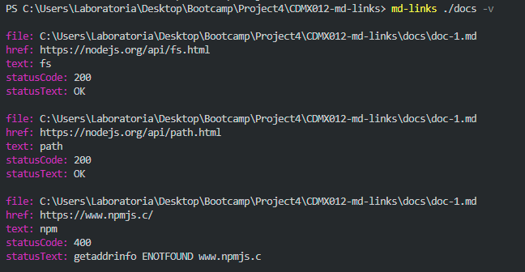
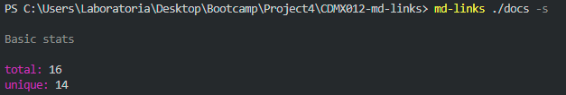
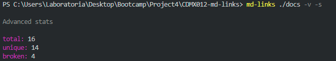
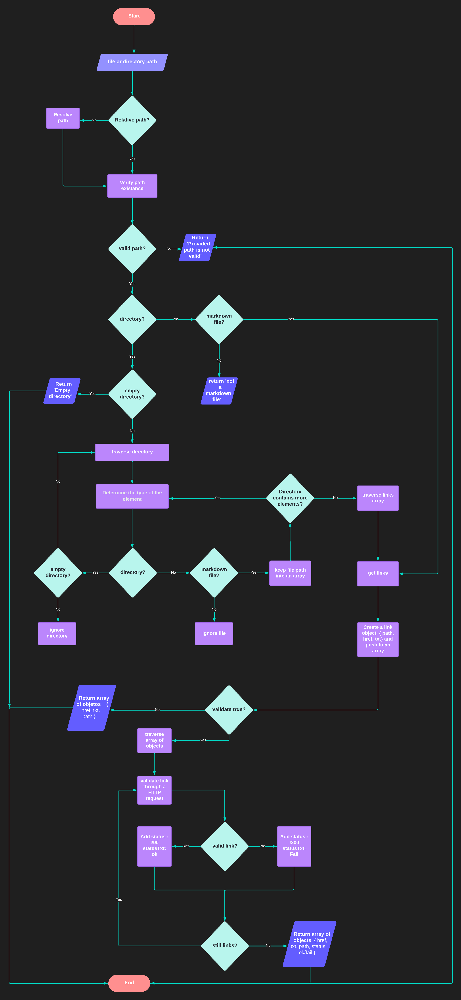
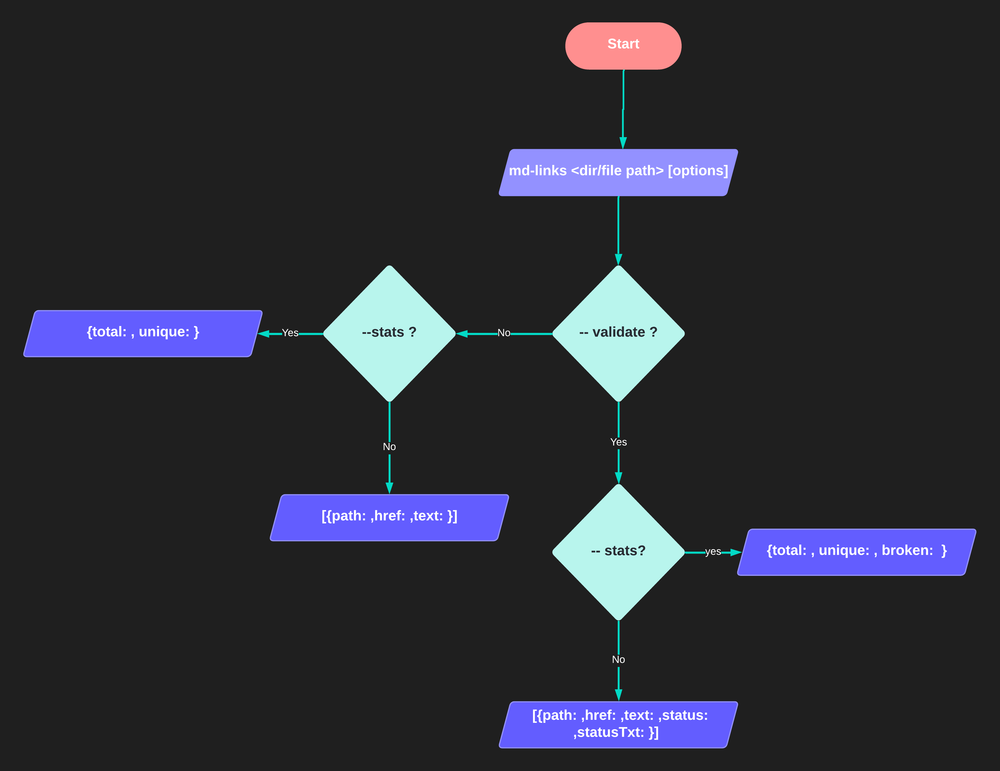

<div id="top"></div>
<div align="center">

# Markdown Links

<a title="JavaScript" href="https://developer.mozilla.org/es/docs/Web/JavaScript"></a>
<a title="Node" href="https://nodejs.org/es/"></a>
<a title="Jest" href="https://jestjs.io/"></a>

This project consists of a command line tool (CLI) as well as a JavaScript library. Md-links allows us to validate the status of links from Markdown files and obtain basic and advanced statistics about the links.

[Getting started](#-getting-started) •
[Installation](#installation) •
[Flowchart](#flowchart) •
[Contributing](#contributing) •
[Contact](#contact) •
[Acknowledgments](#acknowledgments)

</div>

# Getting Started

This project consists of TWO parts

### 1) JavaScript API

The module can be **imported** into other Node.js scripts and offers the
following interface:

#### `mdLinks(path, option)`

#### Arguments

- `path`: **Absolute** or **relative** path to the **file** or **directory**.
- `option`: Boolean value indicating whether to validate or not.

#### Return value

The function **returns a promise** (`Promise`) that **resolves to an array**
(`Array`) of objects (`Object`), where each object represents a link and contains
the following properties

With `option === false` :

- `href`: URL found.
- `text`: Text that appeared inside the link (`<a>`).
- `file`: Path of the file where the link was found.

With `option === true` :

- `href`: URL found.
- `text`: Text that appeared inside the link (`<a>`).
- `file`: Path of the file where the link was found.
- `status`: HTTP response code.
- `ok`: Message `fail` on failure or `ok` on success.

#### Example

```js
const mdLinks = require("md-links");

mdLinks("./some/example.md")
  .then((links) => {
    // => [{ href, text, file }, ...]
  })
  .catch(console.error);

mdLinks("./some/example.md", { validate: true })
  .then((links) => {
    // => [{ href, text, file, status, ok }, ...]
  })
  .catch(console.error);

mdLinks("./some/dir")
  .then((links) => {
    // => [{ href, text, file }, ...]
  })
  .catch(console.error);
```

### 2) CLI (Command Line Interface)

The executable of our application is executed through the **terminal**:

`md-links <path-to-file> [options]`

For example:

<p align="center">

</p>

#### Options

##### `--validate`

If we pass `--validate` or `-v` option, the module must make an HTTP request to
find out if the link works or not. If the link results in a redirect to a
URL that responds ok, then we will consider the link as ok.

For example:

<p align="center">

</p>

We see that the _output_ in this case includes the word `ok` or `fail` after
the URL, as well as the status of the response received to the HTTP request to that
URLs.

##### `--stats`

If we pass `--stats` or `-s` option the output will be a text with basic statistics
about the links.

For example:

<p align="center">

</p>

We can also combine `--stats` and `--validate` to get statistics that
need validated results.

For example:

<p align="center">

</p>

<p align="right">(<a href="#top">back to top</a>)</p>

# Installation

#### With [npm](https://npmjs.com)

```
npm install md-links/sr
```

#### With Git

```
git clone https://github.com/SaraiRojas/CDMX012-md-links.git
```

<p align="right">(<a href="#top">back to top</a>)</p>

# Flowchart

### API flowchart

<br/>
<p align="center">

</p>

### CLI flowchart

<br/>
<p align="center">

</p>

<p align="right">(<a href="#top">back to top</a>)</p>

# Contributing

Contributions are what make the open source community such an amazing place to learn, inspire, and create. Any contributions you make are **greatly appreciated**.

Suggested contributions:

- Add the line property to each `link` object indicating which `line` of the file the link was found on.
- Add more stats.

If you have a suggestion that would make this better, please fork the repo and create a pull request. You can also simply open an issue with the tag "enhancement".
Don't forget to give the project a star! Thanks again!

1. Fork the Project
2. Create your Feature Branch (`git checkout -b feature/AmazingFeature`)
3. Commit your Changes (`git commit -m 'Add some AmazingFeature'`)
4. Push to the Branch (`git push origin feature/AmazingFeature`)
5. Open a Pull Request

<p align="right">(<a href="#top">back to top</a>)</p>

# Contact

[Sarai Rojas]- sara.r.sandoval@gmail.com
<br/>
<br/>
<a title="Jest" href="https://www.linkedin.com/in/sarai-rojas-sandoval/"></a>

<p align="right">(<a href="#top">back to top</a>)</p>

# Acknowledgments

- [Material Icons](https://github.com/alexandresanlim/Badges4-README.md-Profile)

<p align="right">(<a href="#top">back to top</a>)</p>
